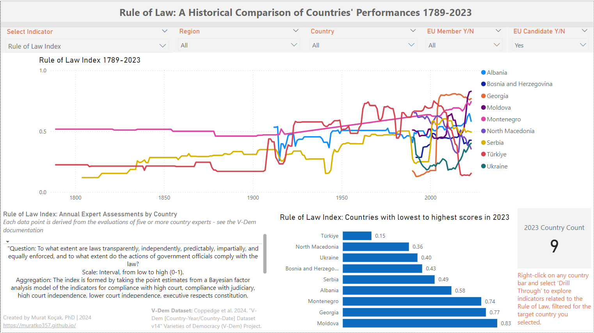

# Rule of Law Dashboard Project

## Rule of Law: A Historical Comparison of Countries' Performances 1789-2023

_Tools: Power BI, DAX_

This interactive Power BI dashboard leverages the V-Dem Dataset (Varieties of Democracy) and provides a comprehensive analysis of the Rule of Law Index and related indicators from 1789 to 2023, offering insights into governance standards across various nations, with a focus on EU members and candidate countries. In order to enrich the dataset, I added calculated columns for Geographic Regions, EU Candidates, and EU Membership Status based on historical data, allowing users to explore trends within specific regional contexts and EU expansion over time. Key features include:

 

**Historical Trends Analysis:**
Visualizes the evolution of governance indicators, such as access to justice and judicial independence, enabling users to track trends over centuries. EU expansion is highlighted with dynamically updated information as users hover over specific years.

**Dynamic Indicator Calculations:**
The dashboard employs advanced DAX formulas to allow users to select indicators and dynamically update the visualizations, providing indicator-specific insights tailored to user preferences.

**Country Comparisons:**
Users can select individual countries or regions, such as Europe or EU candidates, to compare rule of law performance. A bar chart ranks countries based on their most recent scores, offering a quick visual comparison across selected nations.

**Country-Specific Ranking and Score Analysis:**
On drill-through pages, users can view each selected country’s historical name, historical score, and ranking for each Rule of Law indicator by year, enabling detailed, year-over-year comparisons within a global context.

**Interactive Tooltips and Descriptions:**
Tooltips and dynamic text boxes provide definitions and detailed explanations for each indicator, alongside contextual information from the dataset codebook and relevant academic references.
