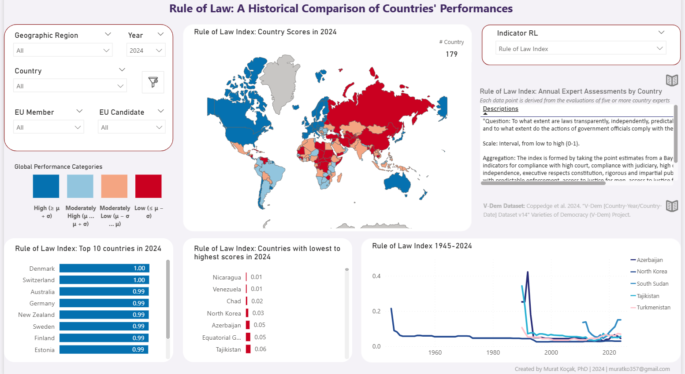
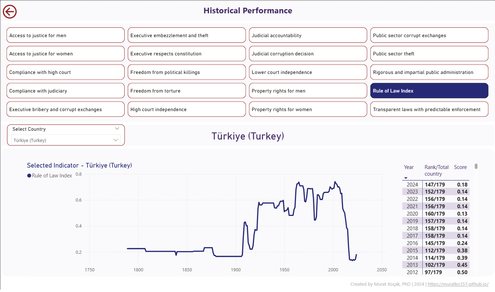

# Visualizing Rule of Law: A Dynamic Dashboard for Historical, Regional, and Country-Level Analysis

_Tools: Power BI, DAX_

This interactive Power BI dashboard utilizes the V-Dem Dataset (Varieties of Democracy) to examine the Rule of Law Index and related indicators across global nations from 1789 to 2023. Through advanced DAX calculations, it provides dynamic insights into historical trends, including judicial independence, access to justice, and the predictability of legal enforcement. By offering perspectives on governance evolutions at regional and national scales, the dashboard empowers researchers, policymakers, and security analysts to explore institutional resilience, societal stability, and the trajectory of democratic development.

  
   
  <small style="color:gray; font-size: 0.8em;"><em>Screenshot: Main page</em></small>

 

**Historical Trends Analysis:**
Visualizes the evolution of rule of law indicators, enabling users to track trends over centuries. EU expansion is highlighted with dynamically updated information as users hover over specific years.

**Dynamic Indicator Calculations:**
The dashboard employs advanced DAX formulas to allow users to select indicators and dynamically update the visualizations, providing indicator-specific insights tailored to user preferences.

**Country Comparisons:**
Users can select individual countries or regions, such as Europe or EU candidates, to compare rule of law performance. A bar chart ranks countries based on their most recent scores, offering a quick visual comparison across selected nations.

**Country-Specific Ranking and Score Analysis:**
On drill-through pages, users can view each selected country’s historical name, historical score, and ranking for each rule of law indicator by year, enabling detailed, year-over-year comparisons within a global context.

**Interactive Tooltips and Descriptions:**
Tooltips and dynamic text boxes offer relevant academic references, detailed definitions, and explanations for each indicator, enhanced with contextual information and additional insights into significant EU expansions and some key political events. These features are designed to be customizable and can be further refined to address specific regional or country-specific requirements.

  
   
  <small style="color:gray; font-size: 0.8em;"><em>Screenshot: Drill through page</em></small>

 

**Impact:**

The Rule of Law Dashboard enables dynamic comparisons across countries and regions, revealing historical and contemporary trends that inform discussions on security, institutional integrity, and democratic resilience. The tool supports informed decision-making, fosters regional understanding, and highlights the rule of law’s critical role in advancing democratic governance and societal stability.

--- 

**Appendix**

- DAX code scripts for dynamic measures and visualization titles
- V-Dem database codebook, published by University of Gothenburg, V-Dem Institute in 2024
