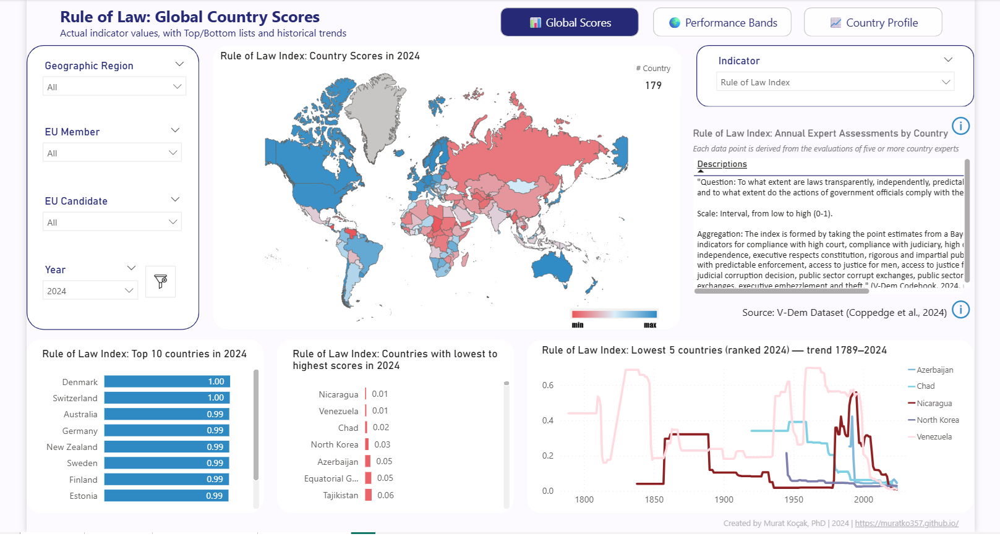
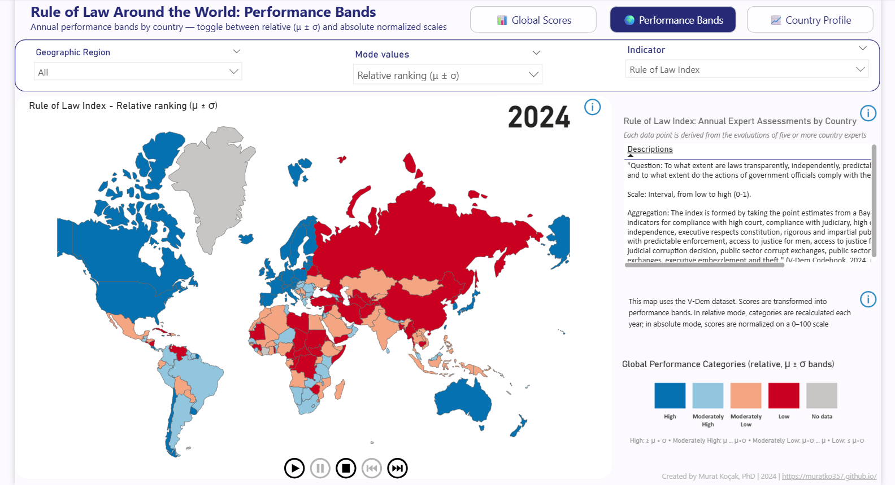
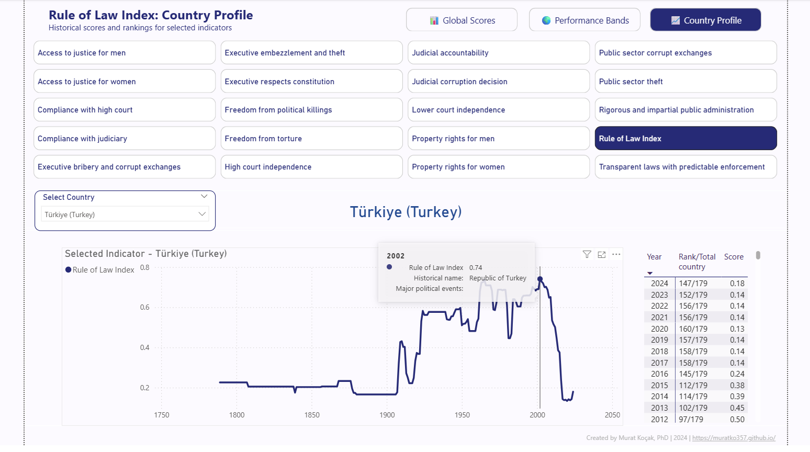

# Visualizing Rule of Law: A Dynamic Dashboard for Global, Comparative, and Country-Level Insights

_Tools: Power BI, DAX_

This interactive Power BI dashboard, built with the V-Dem Dataset (Varieties of Democracy, 2024 edition), explores the Rule of Law Index and related indicators across more than 170 countries from 1789 to 2024. Using advanced DAX measures and dynamic visuals, the dashboard allows users to switch seamlessly between global scores, comparative performance bands, and detailed country profiles.

By combining long-term historical data with flexible filters (region, EU membership, candidate status, year, and indicator), the dashboard supports researchers, policymakers, and analysts in examining institutional resilience, governance patterns, and democratic development.

**1. Global Scores**

View original indicator values across the world on a gradient color map.

- Top and bottom country rankings for the latest year.

- Long-term historical trends of lowest-scoring countries.

- Filters for region, EU membership, and year.

  
   
  <small style="color:gray; font-size: 0.8em;"><em>Screenshot: Global view</em></small>

 

**2. Global Performance Bands**

Explore comparative standing with categories recalculated each year.

- Toggle between Relative bands (μ ± σ) and Absolute normalized (0–100) scales.

- Animated play axis shows the evolution of global performance year by year.

- Consistent four-color scheme highlights shifts in relative or absolute positions.

  
   
  <small style="color:gray; font-size: 0.8em;"><em>Screenshot: Global performance bands</em></small>

 

**3. Country Profile**
Drill into a single country’s trajectory.

- Select any indicator to view its historical scores from 1789–2024.

- Dynamic tooltips include historical country names and contextual notes.

- Yearly table with score, rank, and total country count for precise comparison.

  
   
  <small style="color:gray; font-size: 0.8em;"><em>Screenshot: Country view</em></small>

 

**Interactive Features**

- Dynamic DAX measures adapt maps, charts, and titles to user selections.

- Tooltips and descriptions provide definitions, scale explanations, and source details.

- Navigation bar enables smooth movement between Global Scores, Performance Bands, and Country Profile.

**Impact**

The Rule of Law Dashboard makes it possible to:

- Track centuries-long historical trajectories of institutional development.

- Compare countries and regions in both absolute performance and relative global standing.

- Support evidence-based policy and analysis on governance, security, and democratic resilience.

--- 
_Source: V-Dem Dataset v14 (V-Dem Institute, 2024) retrieved from https://v-dem.net/data/the-v-dem-dataset/._
